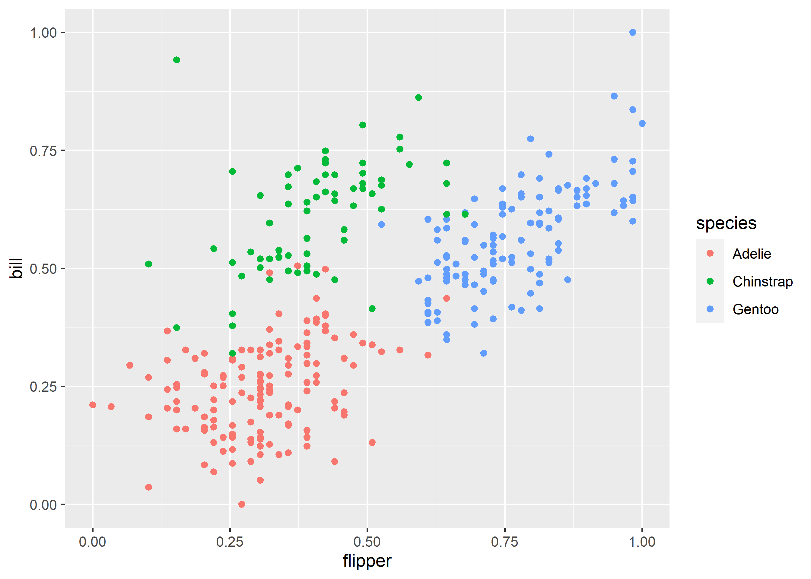
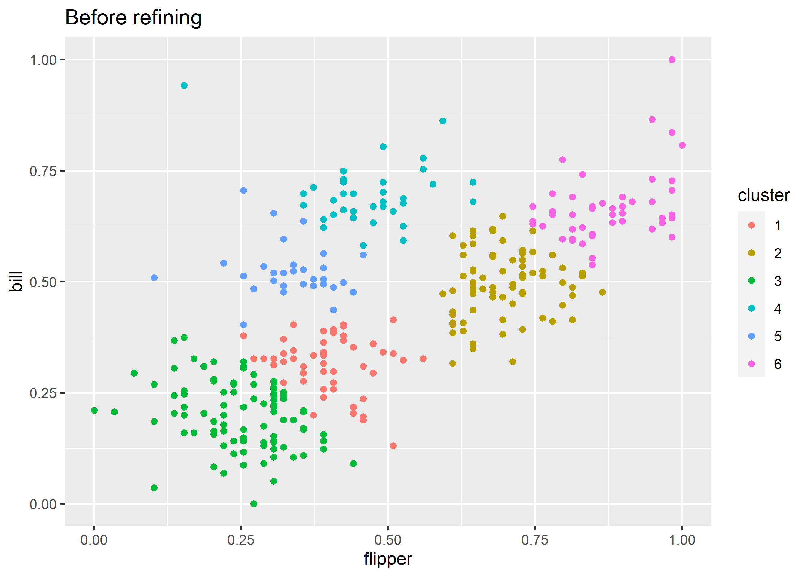

<!-- README.md is generated from README.Rmd. Please edit that file -->

# CluReAL

<!-- badges: start -->
<!-- badges: end -->

‘CluReAL’ is a port of the Python implementation of the algorithm
‘CluReAL.v2’, which is designed improve an existing clustering solution
by splitting multimodal clusters, merging akin clusters, and marking
tiny or low-density clusters as outliers (noise). Additionally, symbolic
key ideograms can be created to interpret clusters in high-dimensional
space. The approach is described in detail in the article by Iglesias et
al. (2021) <https://doi.org/10.1007/s41060-021-00275-z>.

## Installation

<!-- You can install the released version of CluReAL from [CRAN](https://CRAN.R-project.org) with: -->
<!-- ``` r -->
<!-- install.packages("CluReAL") -->
<!-- ``` -->

You can install the development version from
[GitHub](https://github.com/) with:

``` r
# install.packages("remotes")
remotes::install_github("unmnn/CluReAL")
```

## Example

A typical CluReAL workflow:

1.  Create the *cluster context* by calling `cluster_context(x, y)`,
    where the matrix `x` represents the dataset with m observations and
    n dimensions, and `y` is the integer vector of length m containing
    the cluster membership indices (-1 represents noise). The output is
    a list with the following elements:

-   `k`: number of clusters (integer)
-   `centroids`: centroid coordinates (k x n matrix)
-   `mass`: cluster sizes (integer vector of length k)
-   `mn_da`: mean Euclidean distances of the cluster members to their
    centroid (double vector of length k)
-   `md_da`: median Euclidean distances of the cluster members to their
    centroid (double vector of length k)
-   `sd_da`: standard deviation of the Euclidean distances of the
    cluster members to their centroid (double vector of length k)
-   `de`: Euclidean distance matrix for the centroids (k x k matrix)
-   `outliers`: number of outliers (integer)

2.  Compute the cluster validity measures by calling `gval(cc)` using
    the output object from step 1. The output is a list with the
    following elements:

-   `g_str`: strict G-index (double)
-   `g_rex`: relaxed G-index (double)
-   `g_min`: min G-index (double)
-   `oi_st`: cluster-individual strict overlap indices (double vector of
    length

11. 

-   `oi_rx`: cluster-individual relaxed overlap indices (double vector
    of length

11. 

-   `oi_mn`: cluster-individual min overlap indices (double vector of
    length k)
-   `ext_r`: extended cluster radii (double vector of length k)
-   `str_r`: strict cluster radii (double vector of length k)
-   `vol_r`: extended-to-core ratio

3.  Compute the *refinement context* by calling
    `refinement_context(x, y, cc, gv)`. The output is a list with the
    following elements:

-   `mm`: cluster multimodality flag (logical vector of length k)
-   `k_dens`: cluster-individual relative density (double vector of
    length k)
-   `global_c_dens`: global density (double)
-   `kinship`: cluster kinship matrix (k x k matrix): 0-itself, 1-parent
    and child, 2-relatives, 3-close friends, 4-acquaintances,
    5-unrelated.

4.  Refine the clustering by calling `refine(x, y, cc, gv, rc)`. The
    output is a list with the following elements:

-   `y`: vector of the refined cluster membership indices
-   `cc`: refined cluster context

Load all required packages:

``` r
library(CluReAL)
# install.packages("dplyr")
# install.packages("tidyr")
# install.packages("ggplot2")
# install.packages("palmerpenguins")
# install.packages("patchwork")
library(dplyr, warn.conflicts = FALSE)
library(ggplot2)
library(patchwork)
```

We perform kmeans clustering on the Palmer penguins dataset using the
variables `flipper_length_mm` and `bill_length_mm`. We [min-max
normalize](https://en.wikipedia.org/wiki/Feature_scaling#Rescaling_(min-max_normalization))
the variables to unify their range.

``` r
peng <- palmerpenguins::penguins %>%
  tidyr::drop_na() %>%
  mutate(across(c(flipper_length_mm, bill_length_mm),
                ~ (.x - min(.x)) / (max(.x) - (min(.x))))) %>%
  select(flipper = flipper_length_mm, bill = bill_length_mm, species)
ggplot(peng, aes(x = flipper, y = bill, color = species)) + 
  geom_point()
```



Here, we deliberately call kmeans with a cluster count that is too high.
<!-- + we  -->
<!-- manually specify two noise points (just for demonstration purposes). -->

``` r
set.seed(1)
clustering <- kmeans(peng[c("flipper", "bill")], centers = 6)

peng <- peng %>% mutate(cluster = as.factor(clustering$cluster))

p1 <- ggplot(peng, aes(x = flipper, y = bill, color = cluster)) + 
  geom_point() +
  labs(title = "Before refining")
p1
```



We perform the four steps of CluReAL as described above and compare the
clustering solution before and after refining.

``` r
# Step 1: compute the cluster context
x <- as.matrix(peng[c("flipper", "bill")])
y <- clustering$cluster
cc <- cluster_context(x, y)
cc
#> $k
#> [1] 6
#> 
#> $centroids
#>           [,1]      [,2]
#> [1,] 0.3898305 0.3272727
#> [2,] 0.6949153 0.4963636
#> [3,] 0.2542373 0.2036364
#> [4,] 0.4661017 0.6836364
#> [5,] 0.3389831 0.5109091
#> [6,] 0.8559322 0.6509091
#> 
#> $mass
#> [1] 51 76 94 36 30 46
#> 
#> $mn_da
#> [1] 0.08272528 0.08689488 0.09862634 0.08741196 0.07501477 0.09285836
#> 
#> $md_da
#> [1] 0.07568942 0.08631114 0.08873962 0.06348363 0.05607265 0.08058728
#> 
#> $sd_da
#> [1] 0.04608923 0.04317418 0.05006649 0.07195755 0.05654512 0.06660074
#> 
#> $de
#>           1         2         3         4         5         6
#> 1 0.0000000 0.3488100 0.1834979 0.3644343 0.1905460 0.5674428
#> 2 0.3488100 0.0000000 0.5290428 0.2956801 0.3562293 0.2231832
#> 3 0.1834979 0.5290428 0.0000000 0.5246775 0.3187450 0.7497264
#> 4 0.3644343 0.2956801 0.5246775 0.0000000 0.2144618 0.3912019
#> 5 0.1905460 0.3562293 0.3187450 0.2144618 0.0000000 0.5355711
#> 6 0.5674428 0.2231832 0.7497264 0.3912019 0.5355711 0.0000000
#> 
#> $outliers
#> [1] 0

# Step 2: compute the cluster validity indices
gv <- gval(cc)
gv
#> $g_str
#> [1] -0.9608377
#> 
#> $g_rex
#> [1] 0.5602921
#> 
#> $g_min
#> [1] -1.089659
#> 
#> $oi_st
#> [1] -0.1901652 -0.1761198 -0.1901652 -0.2049703 -0.2049703 -0.1761198
#> 
#> $oi_rx
#> [1] 0.01906884 0.05628481 0.01906884 0.09490551 0.05878394 0.05628481
#> 
#> $oi_mn
#> [1] -1.0872562 -1.0166044 -0.9567611 -0.8860627 -1.0896587 -0.7790851
#> 
#> $ext_r
#> [1] 0.1749037 0.1732432 0.1987593 0.2313270 0.1881050 0.2260598
#> 
#> $str_r
#> [1] 0.07568942 0.08631114 0.08873962 0.06348363 0.05607265 0.08058728
#> 
#> $vol_r
#> [1] 2.310808 2.007194 2.239804 3.643885 3.354666 2.805155

# Step 3: compute the refinement context
rc <- refinement_context(x, y, cc, gv)

# Step 4: refine the clustering
rf <- refine(x, y, cc, gv, rc)
rf
#> $y
#>   [1] 1 1 1 1 1 1 1 1 1 1 1 1 1 1 3 1 1 1 1 1 1 1 1 1 1 1 1 1 1 1 1 1 1 1 1 1 1
#>  [38] 1 3 1 1 1 1 1 1 1 1 1 1 1 1 1 1 1 1 1 1 1 1 1 1 1 1 1 1 1 1 3 1 1 1 1 1 1
#>  [75] 1 1 1 1 1 1 1 1 1 1 1 1 1 1 1 2 1 1 1 1 1 1 1 1 1 1 1 1 1 1 1 3 1 1 1 1 1
#> [112] 1 1 1 1 1 1 1 1 1 1 1 1 2 1 1 1 1 1 1 1 1 1 1 1 1 1 1 1 1 1 1 1 1 1 1 2 2
#> [149] 2 2 2 2 2 2 2 2 2 2 2 2 2 2 2 2 2 2 2 2 2 2 2 2 2 2 2 2 2 2 2 2 2 2 2 2 2
#> [186] 2 2 2 2 2 2 2 2 2 2 2 2 2 2 2 2 2 2 2 2 2 2 2 2 2 2 2 2 2 2 2 2 2 2 2 2 2
#> [223] 2 2 2 2 2 2 2 2 2 2 2 2 2 2 2 2 2 2 2 2 3 2 2 2 2 2 2 2 2 2 2 2 2 2 2 2 2
#> [260] 2 2 2 2 2 2 3 3 3 3 3 3 3 3 3 3 3 3 3 3 3 3 3 3 3 3 1 3 3 3 3 3 3 3 3 3 1
#> [297] 3 1 3 3 3 3 3 3 3 2 3 3 3 3 3 3 2 3 3 3 3 3 3 1 3 3 3 3 3 3 3 3 3 1 3 3 3
#> 
#> $cc
#> $cc$k
#> [1] 3
#> 
#> $cc$centroids
#>           [,1]      [,2]
#> [1,] 0.3050847 0.2436364
#> [2,] 0.7457627 0.5545455
#> [3,] 0.4067797 0.6381818
#> 
#> $cc$mass
#> [1] 145 122  66
#> 
#> $cc$mn_da
#> [1] 0.1225629 0.1356742 0.1303222
#> 
#> $cc$md_da
#> [1] 0.1168517 0.1145514 0.1220094
#> 
#> $cc$sd_da
#> [1] 0.06367254 0.08310484 0.07609425
#> 
#> $cc$de
#>           1         2         3
#> 1 0.0000000 0.5393158 0.4074408
#> 2 0.5393158 0.0000000 0.3491483
#> 3 0.4074408 0.3491483 0.0000000
#> 
#> $cc$outliers
#> [1] 0

peng <- peng %>% mutate(c_refined = as.factor(rf$y))

p2 <- ggplot(peng, aes(x = flipper, y = bill, color = c_refined)) + 
  geom_point() +
  labs(title = "After refining")
p1 + p2
```


Draw the clustering solution ideogram before and after refining.

``` r
ideo_before <- draw_symbol(cc, gv, rc)

y_r <- rf$y
cc_r <- rf$cc
gv_r <- gval(cc_r)
rc_r <- refinement_context(x, y_r, cc_r, gv_r)
ideo_after <- draw_symbol(cc_r, gv_r, rc_r)

ideo_before + ideo_after
```


Interpretation:

-   left: chaotic space, unreliable clusters, `g_str` &lt; 0, `g_rex`
    &lt; 0
-   right: space with strong global overlap, `g_str` &lt; 0,
    `g_rex` &gt; 1

<!-- You'll still need to render `README.Rmd` regularly, to keep `README.md` up-to-date. `devtools::build_readme()` is handy for this. You could also use GitHub Actions to re-render `README.Rmd` every time you push. An example workflow can be found here: <https://github.com/r-lib/actions/tree/master/examples>. -->
<!-- You can also embed plots, for example: -->
<!-- ```{r pressure, echo = FALSE} -->
<!-- plot(pressure) -->
<!-- ``` -->
<!-- In that case, don't forget to commit and push the resulting figure files, so they display on GitHub and CRAN. -->
